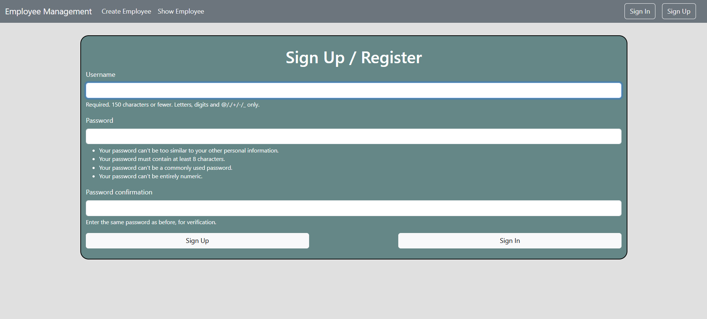
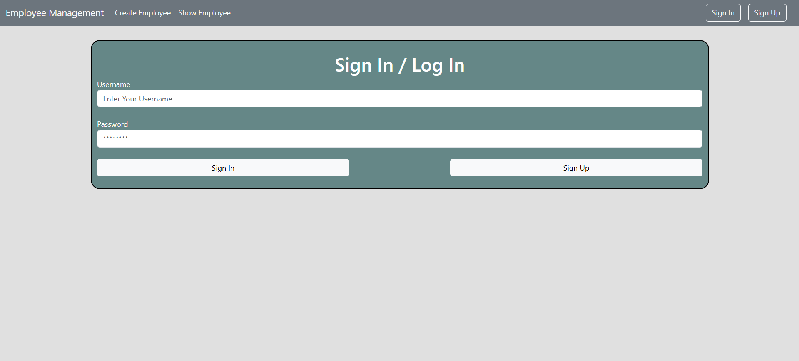
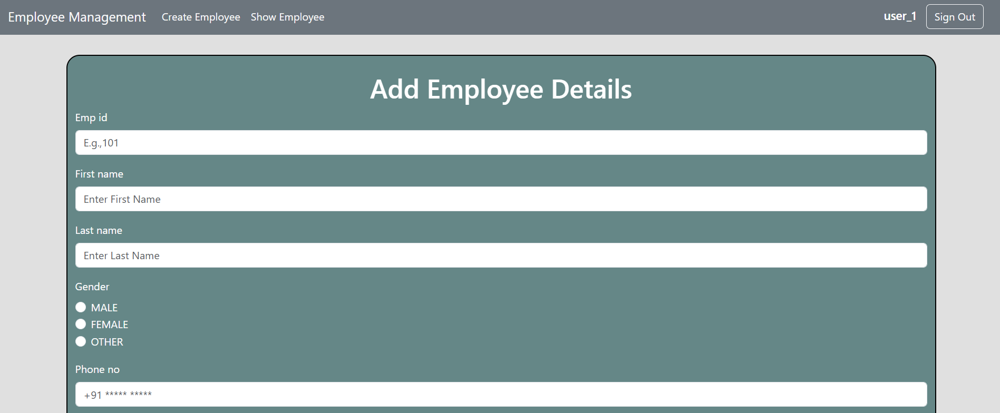
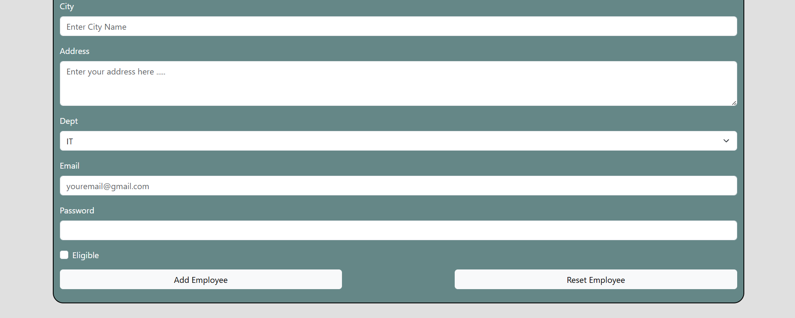
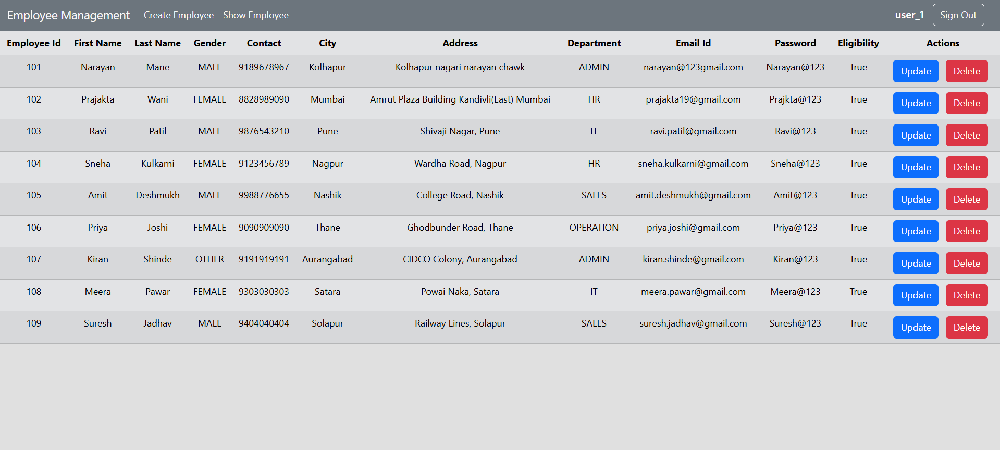
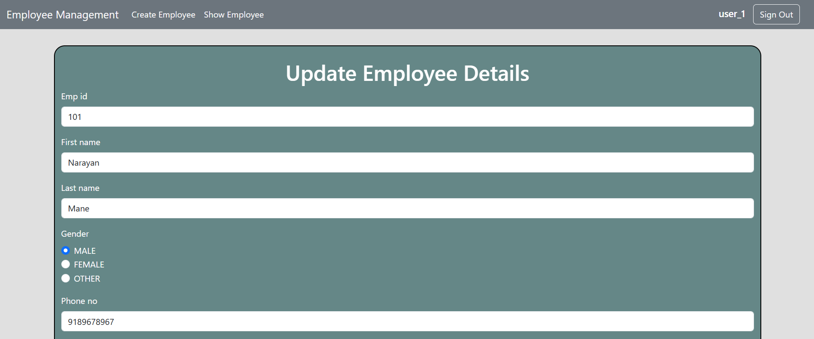
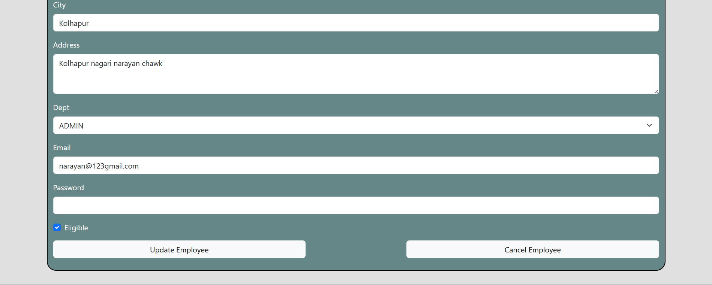
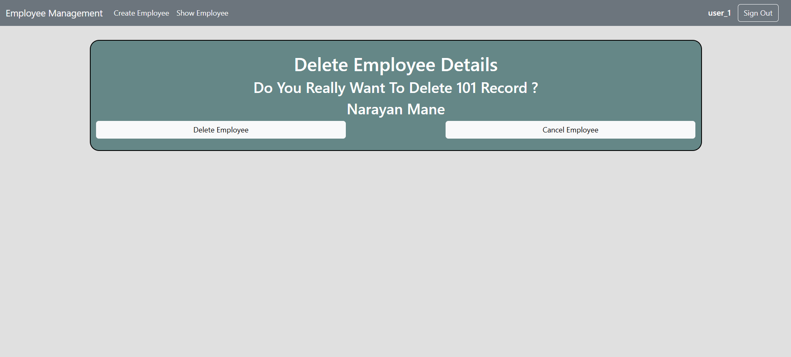

# 🚀 Employee Management System (Django CBV + MySQL)

A web-based **Employee Management System** built using **Django Class-Based Views (CBV)** that performs full **CRUD (Create, Read, Update, Delete)** operations with secure **User Authentication** and **MySQL database integration**.

This project demonstrates Django best practices such as modular app structure and authentication workflow. Ideal for beginners and intermediate developers learning Django.

---

## ✨ Features

* 🔐 User Authentication (Login, Logout, Register)
* ➕ Add Employee Details
* 📋 View Employee List
* ✏️ Update Employee Information
* ❌ Delete Employee Records
* 🧩 Built using Class-Based Views (CBV)
* 🗄️ MySQL Database Integration
* 📁 Clean & Modular Project Structure
* 🧑‍💻 Beginner Friendly Django Project

---

## 🛠️ Tech Stack

### Backend

* 🐍 Python
* 🌐 Django
* 🗄️ MySQL

### Frontend

* 🧱 HTML
* 🎨 CSS
* 🅱️ Bootstrap

### Tools

* 🧰 Git
* 🌍 GitHub
* 🐍 Virtual Environment (venv)

---

## ⚙️ Installation Guide

### 1️⃣ Clone Repository

```bash
git clone https://github.com/omkarpawar2002/employee-management-system-django-cbv-auth.git
```

```bash
cd employee-management-system-django-cbv-auth
```

---

### 2️⃣ Create Virtual Environment

```bash
python -m virtualenv venv
or
python -m venv venv
```

Activate environment:

Windows:

```bash
venv\Scripts\activate
```

Mac/Linux:

```bash
source venv/bin/activate
```

---

### 3️⃣ Install Dependencies

```bash
pip install -r requirements.txt
```

---

### 4️⃣ Configure MySQL Database

Update DATABASES in **settings.py**:

```python
DATABASES = {
    'default': {
        'ENGINE': 'django.db.backends.mysql',
        'NAME': 'your_db_name',
        'USER': 'your_mysql_username',
        'PASSWORD': 'your_mysql_password',
    }
}
```

---

### 5️⃣ Run Migrations

```bash
python manage.py makemigrations
```

```bash
python manage.py migrate
```

---

### 6️⃣ Run Development Server

```bash
python manage.py runserver
```

Open browser:

```
http://127.0.0.1:8000/
```

---

## 🔑 Authentication Module

* User Registration
* User Login
* User Logout
* Protected Employee CRUD operations

---

## 📸 Screenshots

### 🔐 Authentication Pages

#### 📝 Signup Page



---

#### 🔑 Signin Page



---

### 👨‍💼 Employee Module

#### ➕ Add Employee (Page 1)



---

#### ➕ Add Employee (Page 2)



---

#### 📋 Show Employees List



---

#### ✏️ Update Employee (Page 1)



---

#### ✏️ Update Employee (Page 2)



---

#### ❌ Delete Employee Confirmation



---

---

## 🚀 Future Improvements

* 🔍 Search Employee
* 📄 Pagination
* 🖼️ Profile Picture Upload
* 👥 Role-based Authentication
* 🔗 REST API using Django REST Framework
* ☁️ Deployment on cloud (Render / AWS)

---

## 🤝 Contributing

Contributions are welcome.

1. Fork the repository
2. Create your feature branch
3. Commit your changes
4. Push to branch
5. Create Pull Request

---

## 📜 License

This project is open-source and available under the MIT License.

---

## 👨‍💻 Author

Omkar Pawar

GitHub:
https://github.com/omkarpawar2002

---